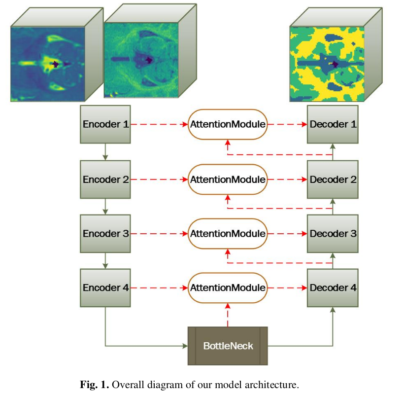
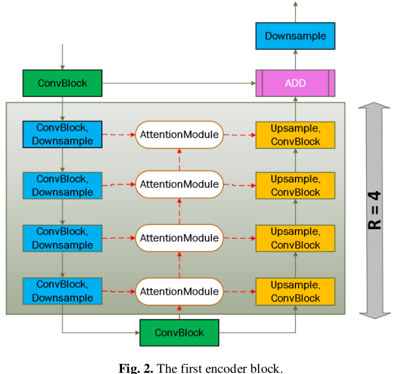
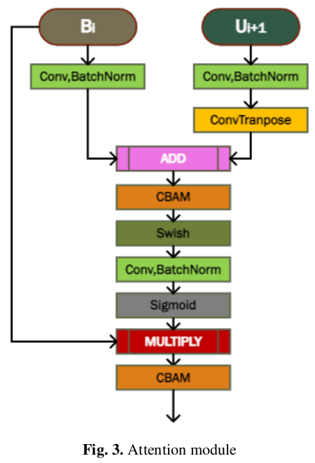
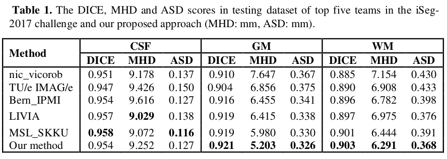

# A Deep Learning-Based Approach with Semi-supervised Level Set Loss for Infant Brain MRI Segmentation
## Introduction
This repository contains the implementation for 6-month infant brain segmentation on the [iSeg-2017](https://iseg2017.web.unc.edu) challenge introduced in the following paper: "A Deep Learning-Based Approach with Semi-supervised Level Set Loss for Infant Brain MRI Segmentation" [https://doi.org/10.1007/978-981-19-2840-6_41](https://doi.org/10.1007/978-981-19-2840-6_41).
## Datasets
The dataset can be downloaded from the [iSeg-2017](https://iseg2017.web.unc.edu) website.
## Our contributions
* Introducing a novel semi-supervised loss function that combines Level set Loss CVES and Active Contour function
* Building the end-to-end model for multiphase segmentation based on U-Net architecture






## Results

## Citation
If you find this repository useful, please cite our paper:
```
@InProceedings{10.1007/978-981-19-2840-6_41,
author="Trinh, Minh-Nhat
and Pham, Van-Truong
and Tran, Thi-Thao",
editor="Ranganathan, G.
and Bestak, Robert
and Fernando, Xavier",
title="A Deep Learning-Based Approach with Semi-supervised Level Set Loss for Infant Brain MRI Segmentation",
booktitle="Pervasive Computing and Social Networking",
year="2023",
publisher="Springer Nature Singapore",
address="Singapore",
pages="533--545",
abstract="Nowadays, numerous deep learning techniques for segmenting medical images have been proposed, with excellent outcomes and the valuable success of machine learning. However, most models use supervised methods while others use unsupervised methods, with less effective outcomes than supervised learning methods. Therefore, this paper introduces a novel level set loss function for unsupervised tasks and incorporates it with the Active Contour loss for supervised tasks. Besides, since previously introduced deep learning models generate less accurate results due to the intensity inhomogeneity issues and the often presence of low-intensity contrast tissues in infant brain segmentation, we propose a new convolutional neural network model to alleviate this problem. Instead of binary segmentation, our proposed loss entitles our model to segment multiple classes with promising outcomes. The proposed technique is utilized to segment neonatal brain magnetic resonance images into four non-overlap regions. The iSeg-2017 challenge, which offers a collection of neonatal brain magnetic resonance images from different sites, is used to evaluate our proposed process. The experiment demonstrates that our new loss function achieves promising results among the 21 participating teams. This illustrates the effectiveness of our technique in multiclass medical image segmentation.",
isbn="978-981-19-2840-6"
}


```